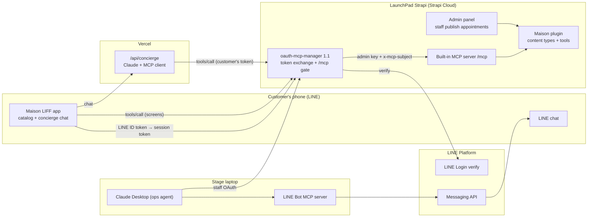

# AX luxury demo: overview

- **Date:** 2026-09-29
- **Status:** Draft for review
- **Talk:** "Content Infrastructure for the AI Era: Building Experiences for Humans and AI", LINE × QBurst Japan, about 20 minutes with a 3-minute demo
- **Sub-project specs:**
  1. [Maison plugin](2026-09-29-maison-plugin-design.md): content types, MCP tools and seed data
  2. [oauth-mcp-manager 1.1](2026-09-29-oauth-mcp-manager-line-design.md): LINE sign-in for customers
  3. [LaunchPad integration, LIFF app and demo](2026-09-29-launchpad-liff-demo-design.md)

## Goal

Show, live, that one content model exposed through one MCP server serves people and agents alike. The talk's claim is "UX and AX", not "AX instead of UX". The same Strapi tools power the screens of an app inside LINE, an AI concierge acting for a customer, and an ops agent acting for staff. Scoped permissions, a human approval step and verification keep the agents honest.

The demo maps to the brief's six AX needs:

| AX need | Where the audience sees it |
|---|---|
| Structured context | A typed content model; tool schemas with enums; ready-made LINE messages returned by a tool |
| Tools | Eight custom tools on Strapi's built-in `/mcp` |
| Permissions | Three tokens with different rights. Identity comes from LINE sign-in, never from the model. |
| Verification | Writes read their record back. The ops agent checks the customer is reachable before claiming a send. |
| Recovery | Tool errors carry a code and a hint for what to do next |
| Deterministic environment | A packaged MCP prompt for the ops run, and the same tool behind the Book button as a fallback |

## Success criteria

1. In one 3-minute run, the audience sees a customer browse in LINE, the concierge request an appointment as a draft, a staff member publish it in the Strapi admin, and an ops agent deliver a LINE confirmation that arrives on the phone.
2. Every piece of data the app shows comes from an MCP tool call, and the "show agent view" toggle proves it on screen.
3. No admin token ever reaches the phone. A customer can only see and create their own appointments, and only as drafts.
4. The ops agent never reports a confirmation as sent unless the customer was reachable (LINE Get Profile succeeded) and LINE accepted the push.
5. Both plugins install into LaunchPad with configuration only, and the Maison plugin installs into any Strapi 5.55.1+ app with MCP enabled.
6. The demo can be reset and re-run in under a minute, and has a fallback for every step that uses AI.

## Decisions

| Decision | Choice | Why |
|---|---|---|
| Brand | A fictional luxury house in the style of Louis Vuitton (trunks, leather goods, monogram personalization). Name to be decided; "Maison" is the placeholder. | A real brand's name, products and photos are trademark and copyright trouble on stage and in a public repo. |
| Language | Japanese (default) and English content, prices in whole yen | Japanese audience and LINE users |
| LINE app | Catalog plus AI concierge | People and an agent use the same content in one app |
| Demo story | Concierge with a human gate: draft, staff publish, LINE delivery by an ops agent | Shows UX, AX, permissions, the human gate and delivery in one flow |
| Data access | Everything goes through Strapi's built-in MCP server, catalog screens included | The talk's point: the tools are the interface for both kinds of consumer |
| No second MCP server | Extend Strapi's MCP with custom tools; the phone speaks MCP to Strapi's `/mcp` directly | Official extension points only |
| Customer identity | New LINE token exchange in `strapi-oauth-mcp-manager` 1.1; a trusted `x-mcp-subject` header reaches tools | Reuses the existing OAuth-for-MCP plugin, and keeps identity out of the model's hands |
| Packaging | Two plugins: Maison (domain) and oauth-mcp-manager (identity). LaunchPad hosts them. | Portable to any Strapi app; each plugin extends independently |
| LINE channel | A LIFF app on a LINE Login channel now, a LINE Mini App channel later | Mini App channels are limited to organizations and residents in Japan, Taiwan and Thailand; the code is the same |
| Delivery | An ops agent (Claude Desktop) sends through LINE Bot MCP | The brief's Strapi MCP plus LINE Bot MCP pairing, with a live verification moment |
| Timeline | Not tight: scope for a complete demo, rehearsed | The user's call |

## Architecture

## Demo scenario

1. The customer opens the Maison app in LINE. LIFF signs them in and gives the app a LINE ID token.
2. The app exchanges it for a short-lived session token at oauth-mcp-manager's token endpoint. The session is tied to `line:U…`.
3. Catalog screens call Maison tools on Strapi `/mcp` directly, with no AI.
4. The customer asks the concierge for a gift and a boutique visit. Claude calls the same tools with the customer's session token and requests the appointment, which is saved as a draft owned by the verified LINE user.
5. A staff member publishes the draft in the Strapi admin. Publishing is the confirmation.
6. The presenter runs the `send_pending_confirmations` prompt in Claude Desktop.
7. For each published appointment without a sent confirmation, the ops agent checks the customer is reachable (`get_profile`), pushes the flex message returned by the tool (`push_flex_message`), and records the outcome (`record_confirmation`).
8. The phone receives the message. Tapping it opens "My visits", which shows Confirmed · LINE sent.

## Who can do what

| Who | Signs in through | Can | Can't |
|---|---|---|---|
| Customer (app and concierge) | LINE ID token exchange | Browse, check availability, request appointments (drafts), see their own appointments | Publish, see other customers, edit content |
| Staff member | Strapi admin login | Review and publish appointments, edit content, load or reset demo data | — |
| Ops agent | oauth-mcp-manager staff consent, with the "Maison ops" token | List published appointments awaiting confirmation, record delivery outcomes | Approve, edit content, browse the catalog |
| LINE Bot MCP | Messaging API channel access token | Check profiles and send LINE messages | Anything in Strapi |

## Build order

1. **Maison plugin** and **oauth-mcp-manager 1.1** can be built in parallel. Neither depends on the other's code; they share only the `x-mcp-subject` header contract (`line:U` followed by 32 hex characters).
2. **LaunchPad integration, LIFF app and demo** need both plugins, the LINE channels and hosting.

Each sub-project gets its own implementation plan.

## Risks and open questions

| Item | Default or mitigation | Decide by |
|---|---|---|
| House name | Placeholder "Maison" (plugin id `maison`) | Before seed content is written |
| Creating a LINE Official Account from a US-based account | Check first during LINE setup. Fallback: ask LINE/QBurst for a provider containing both channels. | Start of sub-project 3 |
| Hosting LaunchPad's Strapi | A Strapi Cloud project for the fork | Start of sub-project 3 |
| Concierge model and provider wiring | Claude Sonnet 5 through the AI SDK, confirmed against installed docs in the plan | Plan for sub-project 3 |
| Relations between non-localized, draft/publish and localized types in Strapi 5.55 | Verified in the first task of the Maison plan. Fallback: store slugs instead of relations. | First task of sub-project 1 |
| Whether MCP prompts can be permission-gated | If not, the prompt holds instructions only and no data, so exposing it is harmless | Sub-project 1 |
| Moving to a LINE Mini App channel | Config change only, if the Mini App channel shares a LINE provider with the Official Account | When LINE/QBurst provide a channel |

## Out of scope

- A LINE sign-in for *external* agents (for example a customer connecting their own Claude) on oauth-mcp-manager's consent page.
- Payments, checkout, inventory sync or real appointment-slot management.
- Staff notifications, and languages beyond Japanese and English.
- Any use of a real brand's name, products or imagery.
