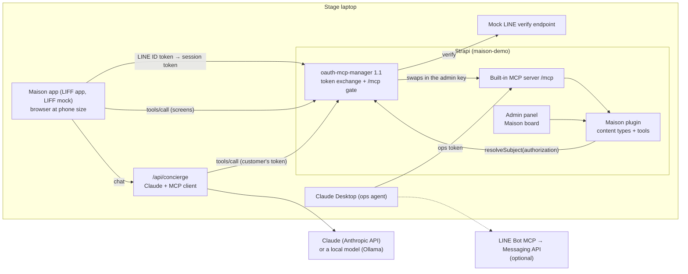

# AX luxury demo: overview

- **Date:** 2026-09-29
- **Status:** Revised 2026-09-29: the stage demo runs without LINE channels, and QBurst presents the MINI App side. Amended 2026-09-30 for the plugins as built: staff confirm on the Maison board, and a local model stands in for the concierge when there's no API key. Moved the same day to a standalone repo, maison-demo, without an in-admin chat. Amended again the same day:
  - the app is LINE MINI App-ready
  - the real app inside LINE is a tested path ("LINE mode", through one tunnel)
  - QBurst's handoff runs it as a MINI App
- **Talk:** "Content Infrastructure for the AI Era: Building Experiences for Humans and AI"
- **Event:** "Building the AI-Powered Connected Experience" by QBurst with LY Corporation. **7 October 2026**, LY Corporation office, Akasaka Trust Tower, Tokyo. Invitation-only, for senior CX, marketing and product leaders. The event's themes include "MINI App integrations with AI-enabled tools and content management systems". LY Corporation's talk covers LINE MINI App and Agent i, and the panel includes LVMH Japan's IT Digital Director.
- **Slot:** 6:00–6:15 PM JST (15 minutes) with a 3-minute demo
- **Talk focus:** the journey from UX to AX. QBurst takes over right after the demo to present the LINE MINI App side, building on the integration this work makes ready.
- **Sub-project specs:**
  1. [Maison plugin](2026-09-29-maison-plugin-design.md): content types, MCP tools and seed data
  2. [oauth-mcp-manager 1.1](2026-09-29-oauth-mcp-manager-line-design.md): LINE sign-in for customers
  3. [The maison-demo repo, the Maison app and the demo](2026-09-29-launchpad-liff-demo-design.md)

## Goal

Show, live, that one content model exposed through one MCP server serves people and agents alike. The talk's claim is "UX and AX", not "AX instead of UX". The same Strapi tools power three things:
- the screens of a customer app built for LINE
- an AI concierge acting for a customer
- an ops agent that prepares, and optionally sends, the customer's LINE confirmation

In between, staff review and confirm requests on the Maison board in the Strapi admin. LINE is the customer's identity and messaging channel. Scoped permissions, that human approval step and verification keep the agents honest.

On stage the app runs in a browser at phone size, with LINE sign-in simulated by LINE's official LIFF mock. The code path is the production one. The LINE MINI App integration is shown on a slide and presented by QBurst.

The demo maps to the brief's six AX needs:

| AX need | Where the audience sees it |
|---|---|
| Structured context | A typed content model; tool schemas with enums; ready-made LINE messages returned by a tool |
| Tools | Ten custom tools on Strapi's built-in `/mcp` |
| Permissions | A customer token, an ops token and the staff's admin role, each with different rights. Identity comes from LINE sign-in, never from the model. |
| Verification | Writes read their record back. The ops agent checks the customer is reachable before claiming a send. |
| Recovery | Tool errors carry a code and a hint for what to do next |
| Deterministic environment | A packaged MCP prompt for the ops run, and the same tool behind the Book button as a fallback |

## Success criteria

1. In one 3-minute run, the audience sees four things:
   - a customer browse the Maison app
   - the concierge request an appointment as a draft
   - a staff member confirm it on the Maison board
   - an ops agent pick it up with a ready-made LINE confirmation

   With the presenter's own Official Account (optional), the agent also delivers it to the phone.
2. Every piece of data the app shows comes from an MCP tool call, and the "show agent view" toggle proves it on screen.
3. No admin token ever reaches the customer's browser. A customer can only see and create their own appointments, and only as drafts. No full LINE user ID reaches a staff surface.
4. The ops agent never reports a confirmation as sent unless the customer was reachable (LINE Get Profile succeeded) and LINE accepted the push.
5. The demo is a repo of its own, maison-demo, that runs with `git clone`, `npm install`, `npm run dev` and `npm run setup`. oauth-mcp-manager installs from npm with configuration only, and the Maison plugin installs into any Strapi 5.55.1+ app with MCP enabled (the demo carries it as a local plugin).
6. The demo can be reset and re-run in under a minute, and has a fallback for every step that uses AI.

## Decisions

| Decision | Choice | Why |
|---|---|---|
| Brand | A fictional luxury house in the style of Louis Vuitton (trunks, leather goods, monogram personalization). Name to be decided; "Maison" is the placeholder. | A real brand's name, products and photos are trademark and copyright trouble on stage and in a public repo. |
| Language | Japanese (default) and English content, prices in whole yen | Japanese audience and LINE users |
| Talk focus | From UX to AX: the same tools serve screens, a customer's agent and a staff agent. QBurst presents the MINI App side afterwards. | The user's call. It splits the stage cleanly: content infrastructure here, the LINE channel with QBurst. |
| Customer app | Catalog plus AI concierge, built as a LIFF app that follows LINE's MINI App design guidelines (channel icon, safe area, loading icon). Shown on stage in a browser at phone size. | People and an agent use the same content in one app. The same code runs inside LINE, and LINE mode tests it there. |
| Demo story | Concierge with a human gate: draft, staff confirm on the Maison board, LINE delivery by an ops agent. No in-admin chat. | Shows UX, AX, permissions, the human gate and delivery in one flow. The story is customers' agents working with the store's data, with LINE as identity and messaging (the user's call, 30 September). |
| Models | Claude Sonnet 5 with an API key; without one, a local model (`qwen3-14b-32k` on Ollama) for the concierge | Rehearsal needs no key, and the local model is an offline fallback. Claude Desktop, the ops agent, still needs the internet. |
| Data access | Everything goes through Strapi's built-in MCP server, catalog screens included | The talk's point: the tools are the interface for both kinds of consumer |
| No second MCP server | Extend Strapi's MCP with custom tools; the phone speaks MCP to Strapi's `/mcp` directly | Official extension points only |
| Customer identity | New LINE token exchange in `strapi-oauth-mcp-manager` 1.1. Tools ask its `resolveSubject(authorization)` which LINE user holds the caller's session token. | Reuses the existing OAuth-for-MCP plugin and keeps identity out of the model's hands. Headers set by a middleware never reach tools (the MCP transport reads raw headers), so no identity header is used. |
| Packaging | Two plugins: Maison (domain) and oauth-mcp-manager (identity). A repo of its own, maison-demo, hosts them: Maison as a local plugin in its Strapi app, oauth-mcp-manager from npm. | Portable to any Strapi app; each plugin extends independently. A standalone repo can be shared, and QBurst can run it. |
| LINE on stage | **No LINE channel needed.** LINE's official LIFF mock signs in a demo customer. A local stand-in for LINE's ID-token verify endpoint accepts that customer's token. Everything else is the production path: ID token, then token exchange, then a session tied to `line:U…`. | The presenter can't create a MINI App channel: under LINE's MINI App Policy (effective 19 February 2026), only individuals in Japan, Taiwan or Thailand, and organizations with a Japanese corporate number or a Taiwanese or Thai tax ID, can. Switching to a real LIFF app or MINI App is configuration only. |
| LINE mode (tested) | The same app inside LINE on the presenter's phone, through his own LINE Login channel and LIFF app. One ngrok origin serves the app, which proxies Strapi's MCP, token endpoint and images. A one-command switch changes modes, and a tunnel guard refuses while a mock could sign anyone in. | A MINI App is a LIFF app, so this is the MINI App path minus the channel. QBurst's Japan-eligible provider supplies the channel, and only the LIFF ID and channel ID change. |
| Confirmation | The ops agent lists staff-confirmed visits, each with a ready-made LINE flex message, then hands over to QBurst. **Optional:** with the presenter's own Official Account, LINE Bot MCP delivers it to the phone. | The delivery channel is LINE's side of the story. A verified MINI App would use service messages instead. |
| Hosting | Everything runs on the stage laptop, on 127.0.0.1: Strapi, the app and the mock verify endpoint. The concierge calls Claude over the internet. LINE mode adds one ngrok origin, to the app only. | No public URL is needed on stage, and there are fewer moving parts. Strapi's admin never goes public. |
| Timeline | Not tight: scope for a complete demo, rehearsed | The user's call |

## Architecture

In production the verify step goes to LINE's own endpoint and the app runs inside LINE as a LIFF app or MINI App. Nothing else changes. LINE mode tests exactly that on the presenter's phone, with the app passing Strapi's `/mcp`, token endpoint and images on from one public origin.

## Demo scenario

1. The customer opens the Maison app. LIFF signs them in and gives the app a LINE ID token. On stage LIFF is mocked.
2. The app exchanges the ID token for a short-lived session token at oauth-mcp-manager's token endpoint, which verifies it with LINE's endpoint (the local stand-in on stage). The session is tied to `line:U…`.
3. Catalog screens call Maison tools on Strapi `/mcp` directly, with no AI. The "agent view" shows each call.
4. The customer asks the concierge for a gift and a boutique visit. Claude calls the same tools with the customer's session token and requests the appointment. It's saved as a draft owned by the signed-in LINE user.
5. The request appears on the Maison board in the Strapi admin, and a staff member confirms it there. Confirming publishes the appointment.
6. In Claude Desktop, the ops agent lists confirmed visits that still need a LINE confirmation, each with a ready-made LINE flex message. It can't approve or edit anything.
7. **Default:** the agent runs `send_pending_confirmations` and stops at the ready-made message, and the presenter hands over to QBurst ("this is where LINE delivers it"). **Optional**, with the presenter's Official Account, the agent goes on:
   - it checks the customer is reachable (`get_profile`)
   - it pushes the message (`push_flex_message`)
   - it records the outcome (`record_confirmation`), and the phone receives it

## Who can do what

| Who | Signs in through | Can | Can't |
|---|---|---|---|
| Customer (app and concierge) | LINE ID token exchange (LIFF mock on stage) | Browse, check availability, request appointments (drafts), see their own appointments | Publish, see other customers, edit content |
| Staff member | Strapi admin login | Review and confirm requests (on the board, or in the Content Manager), edit content, load or reset demo data | See a customer's full LINE user ID |
| Ops agent | The "Maison ops" admin token, directly or through oauth-mcp-manager's staff consent | List published appointments awaiting confirmation, record delivery outcomes | Approve, edit content, browse the catalog |
| LINE Bot MCP (optional) | Messaging API channel access token | Check profiles and send LINE messages | Anything in Strapi |

## Build order

1. **Maison plugin** and **oauth-mcp-manager 1.1** can be built in parallel. They share one service contract: `strapi.plugin('strapi-oauth-mcp-manager').service('oauth').resolveSubject(authorizationHeader)` returns `line:U` + 32 hex characters, or `null`. Maison's tests stub it; oauth-mcp-manager's tests exercise it.
2. **The maison-demo repo, the Maison app and the demo** need both plugins: Maison's code, and oauth-mcp-manager 1.1.0 on npm. They don't need LINE channels or hosting.

Each sub-project gets its own implementation plan.

## Risks and open questions

| Item | Default or mitigation | Decide by |
|---|---|---|
| House name | Placeholder "Maison" (plugin id `maison`) | Before seed content is written |
| Venue network: the concierge needs Claude over the internet | Phone hotspot. The product page's Book button runs the same tool without AI. The local model runs offline, but slower. | Rehearsal |
| Optional real LINE delivery: the presenter's own Official Account from a US-based account | Not needed for the default run. Try it once the demo works end to end. | 5 October 2026 |
| Handoff to QBurst | Share the integration slide, the "what's ready" list (Part F of the demo spec) and the maison-demo repo with QBurst before the event | 5 October 2026 |
| Time: 8 days to the event | Build order below. If time runs short, cut the admin demo page (seed by script instead), the failure beat, and English UI copy, in that order. Never cut the demo scenario itself. | Daily |
| Concierge model and provider wiring | Claude Sonnet 5 through the AI SDK, or `qwen3-14b-32k` on Ollama without a key. Both checked against the installed packages on 30 September. | Plan for sub-project 3 |
| Relations between non-localized, draft/publish and localized types in Strapi 5.55 | Verified in the first task of the Maison plan. Fallback: store slugs instead of relations. | First task of sub-project 1 |
| Whether MCP prompts can be permission-gated | If not, the prompt holds instructions only and no data, so exposing it is harmless | Sub-project 1 |
| Running inside LINE, and as a MINI App | LINE mode, tested on the presenter's LINE Login channel: `npm run mode:line` sets the channel ID and LIFF ID and drops `LINE_VERIFY_URL`, and the app serves Strapi's paths over https through one tunnel. For a MINI App, QBurst's provider creates the channel, and only the LIFF ID and channel ID change. The MINI App and Official Account must share a provider, or user IDs won't match for delivery. | LINE mode: before the event. The MINI App: QBurst. |

## Out of scope

- A LINE sign-in for *external* agents (for example a customer connecting their own Claude) on oauth-mcp-manager's consent page.
- Payments, checkout, inventory sync or real appointment-slot management.
- Staff notifications, and languages beyond Japanese and English.
- Any use of a real brand's name, products or imagery.
